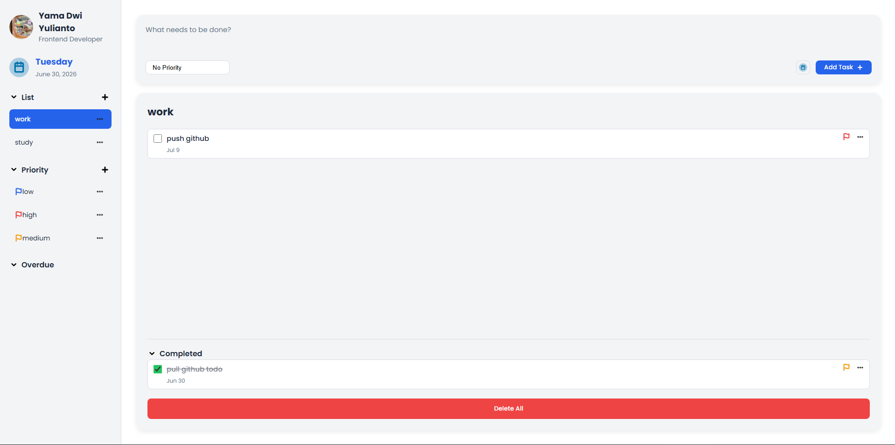
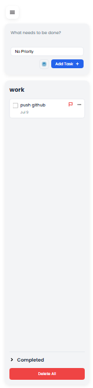

# To-Do List App


A modern and responsive To-Do List application built using **HTML**, **CSS**, and **Vanilla JavaScript**.

This project allows users to organize daily tasks using custom lists, priorities, due dates, and overdue tracking. All data is stored locally using the browser's **Local Storage**, so no backend or database is required.

---

# 📸 Preview

| Desktop                                | Mobile                                |
| -------------------------------------- | ------------------------------------- |
|  |  |

---

# 🚀 Installation

1. Clone this repository

```bash
git clone https://github.com/yamadwi/to-do-list.git
```

2. Open the project folder.

3. Open `indeks.html` using **Live Server** or your browser.

---

# ✨ Features

### 📂 List Management

- ✅ Create List
- ✅ Edit List
- ✅ Delete List

### 🚩 Priority Management

- ✅ Create Priority
- ✅ Edit Priority
- ✅ Delete Priority
- ✅ Custom Flag Color

### ✅ Task Management

- ✅ Create Task
- ✅ Edit Task
- ✅ Delete Task
- ✅ Complete / Uncomplete Task
- ✅ Delete All Tasks
- ✅ No Priority Task

### 📅 Due Date

- ✅ Calendar Picker
- ✅ Due Date
- ✅ Overdue Detection
- ✅ Overdue View

### 📱 Other Features

- ✅ Completed Accordion
- ✅ Sidebar Accordion
- ✅ Empty State
- ✅ Local Storage
- ✅ Responsive Sidebar
- ✅ Responsive Mobile Layout

---

# 🛠 Built With

| Technology       | Description                 |
| ---------------- | --------------------------- |
| HTML5            | Page Structure              |
| CSS3             | Styling & Responsive Layout |
| JavaScript (ES6) | Application Logic           |
| Local Storage    | Data Persistence            |

---

# 📁 Folder Structure

```text
TO-DO-LIST
│
├── assets
│   ├── images
│   │   ├── desktop-preview.png
│   │   └── mobile-preview.png
│   │
│   ├── blue-flag.svg
│   ├── button-calendar.svg
│   ├── foto-profile.svg
│   ├── icon-chevron.svg
│   ├── icon-plus.svg
│   ├── menu.svg
│   ├── red-flag.svg
│   ├── three-dot.svg
│   ├── white-plus.svg
│   └── yellow-flag.svg
│
├── js
│   ├── app.js
│   ├── calendar.js
│   ├── data.js
│   ├── list.js
│   ├── priority.js
│   ├── storage.js
│   └── task.js
│
├── indeks.html
├── indeks-style.css
└── README.md
```

---

# 📱 Responsive Design

### Desktop

- Full Sidebar
- Workspace Layout

### Mobile

- Hamburger Menu
- Collapsible Sidebar
- Responsive Action Bar
- Responsive Workspace
- Mobile Calendar Popup

---

# 💾 Local Storage

The application stores all data locally inside the browser.

Stored data includes:

- Lists
- Priorities
- Tasks
- Current View
- Selected List
- Selected Priority

No backend or database is required.

---

# 🚀 Future Improvements

- 🔍 Task Search
- 🌙 Dark Mode
- 🎯 Drag & Drop Task
- ⏰ Task Reminder
- 📤 Export / Import Data
- ☁️ Cloud Synchronization

---

# 👨‍💻 Author

Developed by **Yama Dwi Yulianto**

- GitHub: https://github.com/yamadwi
